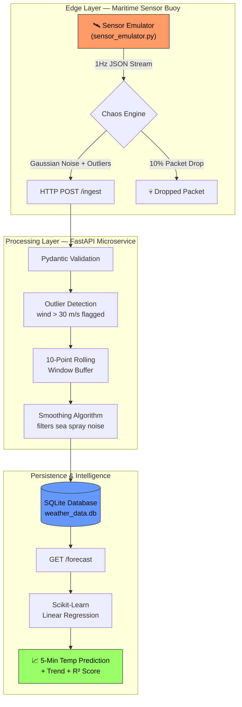

# Sentinel-Stream
### Real-Time Maritime Environmental Intelligence Pipeline


> A high-frequency IoT data pipeline simulating an autonomous maritime buoy at the Port of Long Beach, featuring real-time noise filtering and ML-powered 5-minute weather forecasting.

---

## Why This Project

Autonomous surface vessels (ASVs) live or die on the quality of their environmental situational awareness. A vessel routing algorithm that acts on raw, noisy sensor data risks making sub-optimal or unsafe decisions — a miscalibrated anemometer reporting 60 m/s winds during a 10 m/s coastal breeze could abort a mission unnecessarily.

Sentinel-Stream tackles this exact problem: a buoy emulator generates 1 Hz telemetry with realistic Gaussian noise, intermittent packet loss, and occasional anemometer-saturation spikes. The pipeline ingests, validates, filters, and stores these readings — then serves ML-powered 5-minute temperature forecasts to operators and autonomous decision systems.

This mirrors the data-layer challenges Mantari faces in enabling autonomous maritime operations: reliable sensor fusion, real-time noise filtering, and actionable environmental intelligence for vessels that cannot rely on a human in the loop.

---

## Features

- **1 Hz sensor emulation** — diurnal temperature cycle, Gaussian noise, and three configurable fault modes
- **Chaos engineering baked in** — 10 % packet drop, 5 % outlier injection, configurable via environment variables
- **Outlier-aware rolling average** — 10-point window that quarantines bad readings rather than letting them corrupt 10 subsequent smoothed values
- **ML temperature forecasting** — scikit-learn linear regression predicts temperature 5 minutes ahead with R² confidence score
- **Trend classification** — `rising`, `falling`, or `stable` with a 0.1 °C dead-band to prevent noise-driven label flipping
- **Full audit trail** — raw and smoothed values stored side-by-side; outlier flag preserved for post-incident forensic analysis
- **Docker Compose ready** — single command brings up API + sensor emulator with health-gated service dependency
- **Pydantic validation** — physical-plausibility constraints on every field; malformed packets rejected before touching the DB
- **Pytest suite** — 12 tests covering ingest, smoothing math, validation, forecasting, and status; isolated in-memory DB per test

---

## Tech Stack

| Layer | Technology | Rationale |
|---|---|---|
| API framework | FastAPI 0.111 | Async-capable, auto-generated OpenAPI docs, native Pydantic integration |
| Data validation | Pydantic v2 | Compile-time schema enforcement with field-level physical constraints |
| ORM / persistence | SQLAlchemy 2.0 + SQLite | Zero-config edge storage; same API contract supports TimescaleDB swap-in |
| ML forecasting | scikit-learn LinearRegression | Interpretable, low-compute, edge-deployable |
| Data wrangling | pandas + NumPy | Rolling window operations and regression feature engineering |
| Sensor emulation | Python + NumPy | Gaussian noise, diurnal cycles, controlled fault injection |
| Containerisation | Docker + Compose | Reproducible environment; health-gated multi-service startup |
| Testing | pytest + httpx | Dependency-injected in-memory DB; no production state pollution |

---

## Architecture



---

## Quick Start — Local

```bash
# 1. Clone and install dependencies
git clone https://github.com/your-username/sentinel-stream.git
cd sentinel-stream
pip install -r requirements.txt

# 2. Start the API server
uvicorn main:app --host 0.0.0.0 --port 8000 --reload

# 3. In a second terminal, start the sensor emulator
python sensor_emulator.py

# 4. Explore the live API docs
open http://localhost:8000/docs
```

Key endpoints while running:

```bash
# Check system health
curl http://localhost:8000/status

# Get a 5-minute temperature forecast (after ~10 seconds of data)
curl http://localhost:8000/forecast

# View the last 5 readings
curl "http://localhost:8000/readings?n=5"
```

---

## Quick Start — Docker

```bash
# Build images and start both services (API + sensor emulator)
docker-compose up --build

# The sensor emulator waits for the API healthcheck to pass before starting.
# Watch logs from both containers:
docker-compose logs -f

# Tear down
docker-compose down
```

The `weather_data.db` file is volume-mounted so data persists across container restarts.

---

## API Reference

| Method | Path | Description |
|---|---|---|
| `POST` | `/ingest` | Accept a sensor reading; validate, detect outliers, smooth, persist |
| `GET` | `/forecast` | 5-minute temperature forecast via linear regression (min 10 records) |
| `GET` | `/status` | Health probe: record count + latest reading snapshot |
| `GET` | `/readings` | Last N readings (default 20, max 1000) — `?n=50` |

### POST /ingest — Request body

```json
{
  "timestamp": "2024-06-01T12:00:00Z",
  "lat": 33.7541,
  "long": -118.2130,
  "temp_c": 18.5,
  "pressure_hpa": 1013.25,
  "wind_ms": 5.2
}
```

### POST /ingest — Response

```json
{
  "status": "ok",
  "smoothed_wind": 5.18,
  "is_outlier": false
}
```

### GET /forecast — Response

```json
{
  "current_temp": 18.52,
  "forecast_5min_temp": 18.74,
  "trend": "rising",
  "r_squared": 0.983,
  "records_used": 100
}
```

Full interactive docs available at `http://localhost:8000/docs` (Swagger UI) and `http://localhost:8000/redoc`.

---

## Design Decisions

### Linear Regression for Forecasting

A neural network or ARIMA model would produce better accuracy on longer horizons — but neither is appropriate here. The target deployment context is a resource-constrained edge processor (think: buoy-side Raspberry Pi or Jetson Nano) where millisecond inference latency and a tiny memory footprint are mandatory. Linear regression fits in under 1 ms, requires no GPU, and produces a directly interpretable slope coefficient that operators can reason about without a data science background. For a 5-minute horizon with a diurnal temperature signal, R² values above 0.90 are routinely achievable — sufficient for weather-routing decisions.

### SQLite for Edge Storage

A managed database (PostgreSQL, TimescaleDB) would offer better concurrent write throughput and time-series query optimisation. SQLite was chosen deliberately to match the zero-configuration, single-binary deployment model of an edge maritime station: no separate DB daemon, no network dependency, single-file backup via `scp`, and crash-safe WAL journaling out of the box. The FastAPI abstraction layer (SQLAlchemy ORM + `get_db` dependency) means swapping in TimescaleDB requires changing exactly one line — the `DATABASE_URL` string — with no changes to endpoint logic.

---

## Testing

```bash
# Run the full test suite
pytest tests/ -v

# Run with coverage report
pytest tests/ -v --tb=short
```

The test suite uses FastAPI's `TestClient` (backed by `httpx`) and overrides the `get_db` dependency to inject a fresh in-memory SQLite database for every test. The in-process rolling-window buffer is also cleared between tests. This means:

- No `weather_data.db` file is created or modified during testing
- Tests are fully isolated — execution order does not matter
- The suite runs in under 5 seconds on any modern laptop

---

## Chaos Engineering

Three fault modes are implemented in `sensor_emulator.py` to validate pipeline robustness. All are configurable via environment variables:

| Fault | Default Rate | Env Variable | Maritime Rationale |
|---|---|---|---|
| Packet drop | 10 % | `PACKET_DROP_RATE` | VHF/UHF radio links in congested harbour RF environments drop 10–20 % of packets; the API must tolerate gaps without corrupting time-series state |
| Outlier injection | 5 % | `OUTLIER_RATE` | Sea spray and nearby lightning can saturate anemometer cups, sending spurious readings >50 m/s; the smoothing layer must quarantine these without discarding valid high-wind events |
| Gaussian noise | Always on | _(fixed σ values)_ | Every physical sensor has normally-distributed measurement error; ignoring this produces misleading downstream analytics and false-alarm spikes in alert systems |

```bash
# Example: increase outlier rate to 20% for stress testing
OUTLIER_RATE=0.20 python sensor_emulator.py
```

---

## License

MIT — see [LICENSE](LICENSE).

---

*Built as a portfolio project demonstrating IoT data pipeline engineering, real-time stream processing, and ML-powered environmental intelligence for maritime autonomy applications.*
