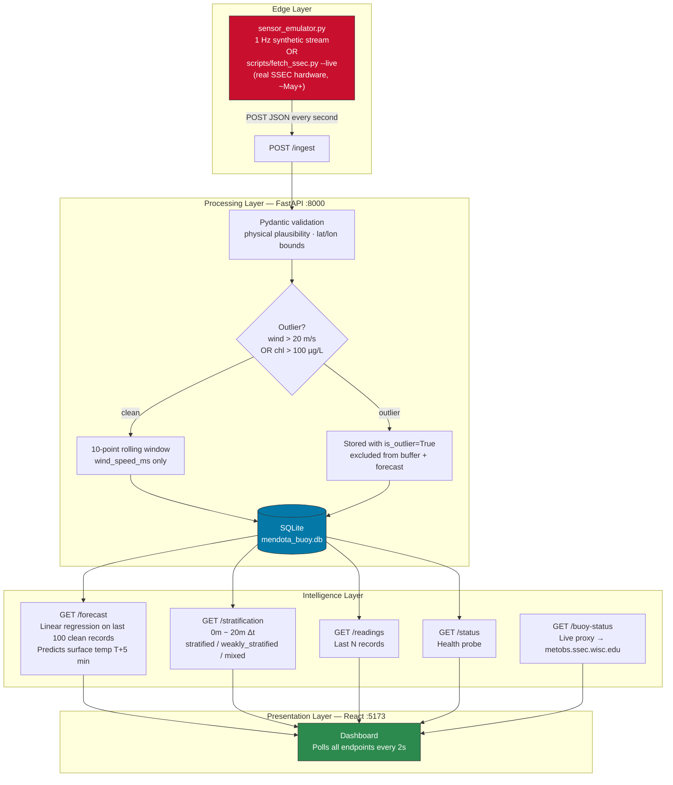

# Sentinel-Stream: Lake Mendota Digital Twin

**Real-Time Environmental Intelligence Pipeline — Full-Stack**


A full-stack IoT data pipeline and live dashboard — a digital twin of the **UW-Madison SSEC / NTL-LTER Lake Mendota Buoy** (43.0988°N, 89.4045°W). The system ingests 1 Hz multivariate sensor telemetry, applies outlier-aware noise filtering, persists to a local database, serves ML-powered environmental forecasts via a REST API, and visualizes everything in a real-time React dashboard.

Built as a portfolio project demonstrating Edge-to-Cloud IoT architecture, real-time data reliability engineering, and autonomous systems intelligence for a Mantari Software Engineering internship application.

---

## What Is and Isn't Live Data

| Component | Live? | Details |
|---|---|---|
| `GET /buoy-status` | **Yes — real** | Hits `metobs.ssec.wisc.edu` and returns the actual SSEC status JSON |
| Sensor telemetry | **No — synthetic** | The physical buoy has been off-station since Nov 19, 2025 (`status_code: 8, "Out for the season"`). `sensor_emulator.py` generates synthetic 1 Hz data calibrated to late-March post ice-out conditions. |
| `scripts/fetch_ssec.py --live` | **Yes, when buoy is online** | When the buoy returns (~May), this command replaces the emulator with real SSEC hardware telemetry — no pipeline changes needed. |

---

## Project Structure

```
sentinal-stream/
├── main.py                  # FastAPI backend — 6 endpoints
├── sensor_emulator.py       # 1 Hz synthetic buoy emulator (digital twin)
├── requirements.txt         # Python dependencies
├── Dockerfile               # Container image for the API
├── docker-compose.yaml      # Two-service stack: api + sensor
├── mendota_buoy.db          # SQLite database (auto-created on first run)
│
├── scripts/
│   └── fetch_ssec.py        # Real SSEC API integration (--status / --historical / --live)
│
├── tests/
│   └── test_main.py         # 17 pytest tests — all passing
│
└── frontend/
    ├── package.json         # React 18 + Recharts + Vite
    ├── vite.config.js       # Dev server on :5173, /api proxy → :8000
    ├── index.html
    └── src/
        ├── main.jsx
        ├── App.jsx          # Main dashboard — polls all endpoints every 2s
        ├── index.css        # Dark maritime theme (CSS variables)
        └── components/
            ├── MetricCard.jsx        # KPI cards (air temp, wind, etc.)
            ├── WindChart.jsx         # Raw vs smoothed wind — Recharts LineChart
            ├── DepthProfile.jsx      # Water temp at 0m/5m/10m/20m — horizontal BarChart
            ├── ForecastCard.jsx      # T+5 min prediction, trend, R² bar
            ├── StratificationCard.jsx# Thermocline Δt, stratification status badge
            └── LiveFeed.jsx          # Last 8 readings table with outlier badges
```

---

## Architecture



---

## Backend — `main.py`

### Endpoints

| Method | Path | Description |
|---|---|---|
| `POST` | `/ingest` | Ingest a validated buoy telemetry packet |
| `GET` | `/forecast` | 5-minute surface water temperature forecast |
| `GET` | `/stratification` | Thermocline strength and stratification status |
| `GET` | `/buoy-status` | Live proxy to the real SSEC MetObs API |
| `GET` | `/status` | System health probe (Docker healthcheck target) |
| `GET` | `/readings?n=20` | Last N buoy records with full depth profile |
| `GET` | `/docs` | Auto-generated interactive OpenAPI documentation |

### `POST /ingest`

Accepts the buoy telemetry schema, runs it through a 5-step processing pipeline:

1. **Pydantic validation** — rejects impossible values before touching the DB (negative wind, lat outside Lake Mendota bounding box, etc.)
2. **Outlier detection** — flags `is_outlier=True` if `wind_speed_ms > 20.0` OR `chlorophyll_ugl > 100.0`
3. **Rolling buffer update** — only clean (non-outlier) readings enter the 10-point `deque(maxlen=10)`. Outliers are stored but never corrupt the smoothing state.
4. **Smoothed wind calculation** — `mean(rolling_buffer)`. Falls back to raw value on cold start.
5. **SQLite persistence** — all fields stored including raw wind, smoothed wind, all 4 depth temperatures, chlorophyll, and outlier flag.

**Response:**
```json
{
  "status": "ok",
  "smoothed_wind_ms": 5.84,
  "is_outlier": false,
  "surface_water_temp_c": 4.02
}
```

### `GET /forecast`

Queries the last 100 clean (non-outlier) records, fits a `sklearn.LinearRegression` model on `(relative_time_seconds → water_temp_0m)`, and predicts surface temperature 300 seconds (5 minutes) ahead.

- Returns **HTTP 422** if fewer than 10 clean records exist
- Trend classification: `rising` / `falling` / `stable` with a ±0.1°C dead-band to prevent noise-driven label flipping
- Returns R² score so callers can assess model confidence

**Response:**
```json
{
  "current_surface_temp_c": 4.02,
  "forecast_5min_surface_temp_c": 4.07,
  "trend": "rising",
  "r_squared": 0.83,
  "records_used": 100
}
```

### `GET /stratification`

Computes thermocline strength from the most recent clean reading:

```
Δt = water_temp_0m − water_temp_20m
```

| Δt | Status | Meaning |
|---|---|---|
| ≥ 10°C | `stratified` | Epilimnion thermally isolated; elevated HAB risk |
| 4–10°C | `weakly_stratified` | Thermocline developing |
| < 4°C | `mixed` | Full water column turning over (current late-March state) |

**Response:**
```json
{
  "surface_temp_c": 4.02,
  "deep_temp_c": 3.41,
  "thermocline_strength_c": 0.61,
  "stratification_status": "mixed",
  "timestamp": "2026-03-22T20:27:00Z"
}
```

### `GET /buoy-status`

Proxies `http://metobs.ssec.wisc.edu/api/status/mendota/buoy.json` in real time. The only endpoint in the system that returns **live external data**.

**Current response (buoy is off-season):**
```json
{
  "ssec_status_code": 8,
  "ssec_status_message": "Out for the season",
  "ssec_last_updated": "2025-11-19 20:27:38Z",
  "pipeline_mode": "emulator",
  "ssec_api_reachable": true
}
```

When `ssec_status_code == 0`, `pipeline_mode` becomes `"live"`.

---

## Sensor Emulator — `sensor_emulator.py`

Simulates the SSEC NTL-LTER buoy at 1 Hz. Values are calibrated to **late-March post ice-out conditions** — Lake Mendota loses ice cover in mid-to-late March and sits nearly isothermal at ~4°C before spring stratification begins.

### Baseline values (late March)

| Sensor | Baseline | Noise σ | Notes |
|---|---|---|---|
| Air temperature | 6.0°C | ±0.25°C | ±4°C diurnal swing over 24h |
| Wind speed | 6.0 m/s | ±0.4 m/s | Prevailing SW winds on Mendota |
| Water temp 0m | 4.0°C | ±0.15°C | Surface — post ice-out |
| Water temp 5m | 3.8°C | ±0.15°C | Nearly isothermal |
| Water temp 10m | 3.6°C | ±0.15°C | Metalimnion |
| Water temp 20m | 3.4°C | ±0.15°C | Hypolimnion |
| Chlorophyll-a | 6.5 µg/L | ±0.8 µg/L | Pre-bloom diatom community |

> **Units note:** The SSEC fluorometer reports raw Relative Fluorescence Units (RFU) which can read 5,000–15,000 RFU. These are **not** µg/L. The Turner Cyclops-7F sensor uses a site-specific calibration factor (~0.001–0.003 µg/L/RFU). This pipeline stores calibrated µg/L values.

### Chaos engineering

Three fault modes are injected to exercise pipeline resilience:

| Mode | Rate | Simulates | Pipeline response |
|---|---|---|---|
| Gaussian noise | Every packet | Thermistor / anemometer / fluorometer instrument noise | Rolling average absorbs it |
| Packet drop | 10% (default) | LoRaWAN / Wi-Fi RF loss between buoy and shore station | Stateless per-request API; gaps cause no state corruption |
| Wind outlier | ~2.5% | Anemometer saturation (spray, mechanical fault) | `is_outlier=True`, excluded from buffer and forecast |
| Chlorophyll outlier | ~2.5% | Fluorometer lens fouling from seasonal biofilm | `is_outlier=True`, excluded from buffer and forecast |

All rates are configurable via environment variables — no restart needed:
```bash
PACKET_DROP_RATE=0.20 OUTLIER_RATE=0.10 python sensor_emulator.py
```

---

## Frontend Dashboard — `frontend/`

Built with **React 18 + Vite + Recharts**. Dark maritime theme. Polls all backend endpoints every 2 seconds.

### Components

| Component | Chart type | Data source |
|---|---|---|
| `MetricCard` | KPI cards | `/readings` latest record |
| `WindChart` | Line chart — raw (orange dashed) vs smoothed (blue solid) | `/readings?n=60` |
| `DepthProfile` | Horizontal bar chart — warm-to-cool color gradient | `/readings` latest depth profile |
| `ForecastCard` | Current temp → T+5 min, trend arrow, R² progress bar | `/forecast` |
| `StratificationCard` | Thermocline Δt, color-coded status badge | `/stratification` |
| `LiveFeed` | Table — last 8 readings, outlier badges | `/readings?n=8` |

The dashboard also shows a **buoy status banner** from `/buoy-status` — currently displays "Out for the season" with `pipeline_mode: emulator`.

All components handle three states: loading (skeleton), empty/insufficient data (graceful message), and populated.

---

## Sensor Schema

The telemetry packet format — matches the real SSEC buoy variable names:

```json
{
  "timestamp": "2026-03-22T20:27:00Z",
  "location": "Lake Mendota — 1.5 km NE of Picnic Point, Madison, WI",
  "lat": 43.0988,
  "long": -89.4045,
  "air_temp_c": 6.0,
  "wind_speed_ms": 6.0,
  "water_temp_profile": {
    "0m": 4.02,
    "5m": 3.83,
    "10m": 3.61,
    "20m": 3.41
  },
  "chlorophyll_ugl": 6.5
}
```

Pydantic validation enforces:
- `lat` in [42.9, 43.2] — Lake Mendota bounding box
- `long` in [−89.6, −89.3]
- `wind_speed_ms` in [0.0, 60.0]
- `chlorophyll_ugl` in [0.0, 1000.0]
- Each depth temperature in [0.0, 35.0]
- `timestamp` non-empty string

---

## Running the Project

### Prerequisites
- Python 3.10+
- Node.js 18+ (for the frontend)
- pip

### Local (3 terminals)

**Terminal 1 — API:**
```bash
pip install -r requirements.txt
uvicorn main:app --reload
# API running at http://localhost:8000
# Interactive docs at http://localhost:8000/docs
```

**Terminal 2 — Sensor emulator:**
```bash
python sensor_emulator.py
# Streams 1 packet/second to /ingest
# Wait ~15 seconds before /forecast and /stratification have enough data
```

**Terminal 3 — Dashboard:**
```bash
cd frontend
npm install      # first time only
npm run dev      # PowerShell: run these as two separate commands
# Dashboard at http://localhost:5173
```

### Docker (API + sensor only, no frontend)
```bash
docker-compose up --build
# API at http://localhost:8000
# Sensor starts automatically once API passes health check
```

---

## Tests

```bash
pytest tests/ -v
```

17 tests, all passing. Each test gets a **fresh in-memory SQLite database** via `StaticPool` + `app.dependency_overrides[get_db]` — no shared state, no writes to `mendota_buoy.db`.

| Test class | What it covers |
|---|---|
| `TestIngestEndpoint` | Valid ingest · wind outlier · chlorophyll outlier · rolling average math · outlier excluded from buffer · surface temp echoed in response |
| `TestForecastEndpoint` | HTTP 422 on < 10 records · rising trend correctly detected |
| `TestStatusEndpoint` | Health probe returns healthy · record count increments |
| `TestPydanticValidation` | Missing field · lat out of range · negative wind · negative chlorophyll · empty body |
| `TestReadingsEndpoint` | Empty DB returns count=0 · depth profile keys present in response |

---

## Live Data Integration (`scripts/fetch_ssec.py`)

Connects to the real SSEC MetObs REST API at `metobs.ssec.wisc.edu`.

### Verified SSEC API endpoints
```
Status:  GET http://metobs.ssec.wisc.edu/api/status/mendota/buoy.json
Data:    GET http://metobs.ssec.wisc.edu/api/data.csv
             ?site=mendota
             &inst=buoy
             &symbols=air_temp:wind_speed:water_temp_1:water_temp_3:
                      water_temp_5:water_temp_7:water_temp_9:
                      chlorophyll:phycocyanin
             &begin=2024-07-01T00:00:00Z
             &end=2024-07-31T23:59:59Z
             &interval=1m
```

The SSEC API returns a pseudo-CSV with metadata headers before the data rows. `fetch_ssec.py` parses this format, maps `water_temp_N` sensor indices to the NTL-LTER thermistor chain depths (water_temp_1 → 0m, water_temp_5 → 5m, water_temp_7 → 10m, water_temp_9 → 20m), and forwards transformed payloads to `/ingest`.

### Commands

```bash
# Check whether the physical buoy is online right now
python scripts/fetch_ssec.py --status

# Seed the database with real summer 2024 data
python scripts/fetch_ssec.py --historical --begin 2024-07-01 --end 2024-07-31 --interval 1m

# Replace the emulator with live SSEC hardware telemetry (~May–November)
python scripts/fetch_ssec.py --live
```

---

## Design Decisions

**Why Linear Regression for `/forecast`?**
Edge-compute environments (shore-station SBC, autonomous vessel compute unit) have constrained resources. Linear Regression fits 100 records in < 1 ms, produces an interpretable slope coefficient (°C/s warming rate), and returns an R² score the calling system uses to decide whether to trust the prediction. A neural network would be overkill for a 5-minute horizon on a slowly-changing limnological signal.

**Why SQLite?**
Zero configuration, no daemon, single-file portability — mirrors how data is stored locally on buoy electronics before batch-sync to a central archive. The same API contract supports TimescaleDB or InfluxDB by changing one line (`DATABASE_URL`).

**Why store outliers instead of discarding them?**
Quarantining outliers from the rolling buffer and forecast regression protects analytics. Discarding them destroys the forensic record — you cannot correlate a false HAB alert with a fluorometer fouling event if the packet was never persisted. Every packet is stored; `is_outlier` determines its influence on downstream analytics.

**Why separate DB columns per depth instead of JSON?**
`water_temp_0m`, `water_temp_5m`, `water_temp_10m`, `water_temp_20m` as individual Float columns allows direct SQL aggregation (`water_temp_0m - water_temp_20m`) without deserializing blobs. Critical for querying stratification trends across thousands of records.

**Why post ice-out baselines?**
Lake Mendota's ice-off date is mid-to-late March (UW-Madison has tracked it since 1855). Right now, the water column sits nearly isothermal at ~4°C — the temperature of maximum density — because winter mixing has erased all stratification. `/stratification` correctly returns `mixed` with Δt ≈ 0.6°C. Summer values (surface ~24°C, 20m ~7°C, Δt ~17°C) are available by seeding with historical data via `fetch_ssec.py --historical`.

---

## Tech Stack

| Layer | Technology | Version |
|---|---|---|
| API | FastAPI | 0.111.0 |
| Validation | Pydantic | 2.7.1 |
| ORM | SQLAlchemy | 2.0.30 |
| Database | SQLite | (bundled) |
| ML | scikit-learn | 1.4.2 |
| Numerics | NumPy | 1.26.4 |
| Data wrangling | pandas | 2.2.2 |
| HTTP server | uvicorn | 0.29.0 |
| HTTP client | requests | 2.31.0 |
| Testing | pytest + httpx | 8.2.0 / 0.27.0 |
| Frontend framework | React | 18.3.1 |
| Frontend build | Vite | 5.4.2 |
| Charts | Recharts | 2.12.7 |
| Container | Docker + Compose | — |

---

## Data Reference

| Resource | Details |
|---|---|
| NTL-LTER buoy dataset | [High-Frequency Met, DO, and Chlorophyll Data](https://lter.limnology.wisc.edu/dataset/north-temperate-lakes-lter-high-frequency-data-meteorological-dissolved-oxygen-chlorophyll) |
| SSEC live data portal | [metobs.ssec.wisc.edu/mendota/buoy](http://metobs.ssec.wisc.edu/mendota/buoy/) |
| Buoy operator | UW-Madison Space Science and Engineering Center (SSEC) + Center for Limnology |
| Buoy coordinates | 43.0988°N, 89.4045°W — 1.5 km NE of Picnic Point, Lake Mendota, Madison, WI |
| Buoy current status | Off-station (`status_code: 8`) since 2025-11-19; returns to service ~May |

---

*Built by a UW-Madison student as a full-stack demonstration of Edge-to-Cloud IoT architecture, real-time sensor data reliability, and environmental intelligence engineering.*
