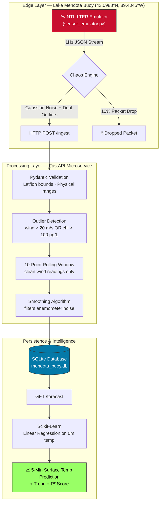

# Sentinel-Stream: Mendota Edition
### Real-Time Lake Environmental Intelligence Pipeline


> A high-frequency IoT data pipeline simulating the **NTL-LTER research buoy on Lake Mendota, Madison, WI**, featuring outlier-aware multivariate smoothing and ML-powered 5-minute surface water temperature forecasting.

As a UW-Madison student, I built this as a digital twin of a sensor platform I can see from campus — the [SSEC / Center for Limnology NTL-LTER buoy](https://lter.limnology.wisc.edu/dataset/north-temperate-lakes-lter-high-frequency-data-meteorological-dissolved-oxygen-chlorophyll) anchored 1.5 km NE of Picnic Point.

**Hardware Abstraction Layer:** Because the physical SSEC Mendota Buoy is currently off-station for the winter (confirmed via `GET /buoy-status` → SSEC API returns `status_code: 8, "Out for the season"`), I developed a high-fidelity emulator calibrated to historical SSEC datasets. It generates telemetry based on late-March post ice-out conditions — including vertical temperature profiles and chlorophyll-a concentrations — to allow for year-round model training and API testing. When the buoy returns to service (~May), a single command (`python scripts/fetch_ssec.py --live`) replaces the emulator with real hardware telemetry, no pipeline changes required.

---

## Why This Project

Autonomous vehicles — whether surface vessels, underwater gliders, or aerial drones — live or die on the quality of their environmental situational awareness. A routing algorithm acting on raw, noisy sensor data risks unsafe decisions. A miscalibrated anemometer reporting 25 m/s winds during a 5 m/s breeze could abort a mission unnecessarily; a fouled fluorometer falsely signalling a harmful algal bloom (HAB) could trigger an incorrect no-sail zone.

Sentinel-Stream tackles this exact problem at the data layer:

- The **emulator** generates 1 Hz multivariate telemetry with realistic Gaussian noise, 10% packet loss, and 5% outlier injection across both wind and chlorophyll channels.
- The **ingest pipeline** validates, filters, and stores every packet — outliers are quarantined from the smoothing buffer but preserved in full for post-incident forensic analysis.
- The **forecast endpoint** produces 5-minute surface water temperature predictions from a real-time linear regression, with an R² confidence score the calling system can use to decide whether to trust the prediction.

This mirrors the data-layer challenges that autonomous environmental intelligence systems face: reliable sensor fusion, real-time noise filtering, and actionable situational awareness for systems that cannot rely on a human in the loop.

---

## Features

- **1 Hz multivariate emulation** — atmospheric (air temp, wind) + sub-surface temperature vertical profile (0m, 5m, 10m, 20m) + chlorophyll-a concentration
- **Thermal stratification modelling** — diurnal surface heating applied with depth-dependent attenuation, replicating Lake Mendota's spring epilimnion dynamics
- **Dual-channel outlier detection** — wind outliers (>20 m/s, inland lake threshold) AND chlorophyll outliers (>100 µg/L, fluorometer fouling threshold) — either triggers quarantine
- **Outlier-aware rolling average** — 10-point window exclusively over clean wind readings; outlier packets never corrupt subsequent smoothed values
- **ML surface temperature forecasting** — scikit-learn Linear Regression predicts 0m water temperature 5 minutes ahead, with R² confidence score and rising/falling/stable trend
- **Full audit trail** — raw and smoothed values, all depth temperatures, chlorophyll, and outlier flag stored side-by-side
- **Lat/lon physical validation** — coordinates validated to the Lake Mendota bounding box; GPS spoofing or unit errors (e.g., degrees vs. radians) rejected at the boundary
- **Docker Compose ready** — single command brings up API + sensor emulator with health-gated startup
- **17-test pytest suite** — in-memory isolated DB per test, covering both outlier fault paths, smoothing math, forecast structure, and all validation constraints

---

## Tech Stack

| Layer | Technology | Rationale |
|---|---|---|
| API framework | FastAPI 0.111 | Async-capable, auto-generated OpenAPI docs, native Pydantic v2 integration |
| Data validation | Pydantic v2 | Field-level physical plausibility constraints; nested schema for depth profile |
| ORM / persistence | SQLAlchemy 2.0 + SQLite | Zero-config edge storage; depth columns enable direct SQL aggregation on stratification data |
| ML forecasting | scikit-learn LinearRegression | Interpretable slope coefficient; fits in <1 ms on edge hardware |
| Data wrangling | pandas + NumPy | Relative-time feature engineering; Gaussian noise generation |
| Sensor emulation | Python + NumPy | Diurnal cycles with depth-attenuated heating, controlled dual-channel fault injection |
| Containerisation | Docker + Compose | Reproducible environment; health-gated multi-service startup |
| Testing | pytest + httpx + StaticPool | Per-test in-memory DB isolation; no production state pollution |

---

## Architecture



---

## Sensor Schema

Mirrors the [NTL-LTER Lake Mendota high-frequency buoy data product](https://lter.limnology.wisc.edu/dataset/north-temperate-lakes-lter-high-frequency-data-meteorological-dissolved-oxygen-chlorophyll).

Values are calibrated to **late March post ice-out conditions** — Lake Mendota is nearly isothermal at ~4 °C immediately after losing ice cover, with stratification onset beginning in April:

```json
{
  "timestamp": "2026-03-22T20:27:00Z",
  "location": "Lake Mendota — 1.5 km NE of Picnic Point, Madison, WI",
  "lat": 43.0988,
  "long": -89.4045,
  "air_temp_c": 6.0,
  "wind_speed_ms": 6.0,
  "water_temp_profile": {
    "0m": 4.0,
    "5m": 3.8,
    "10m": 3.6,
    "20m": 3.4
  },
  "chlorophyll_ugl": 6.5
}
```

> **Units note:** The SSEC fluorometer reports raw Relative Fluorescence Units (RFU) which can read 5,000–15,000 RFU. These are **not** µg/L. The Turner Cyclops sensor used on the Mendota buoy applies a site-specific calibration factor (~0.001–0.003 µg/L per RFU). This pipeline stores the calibrated µg/L value.

---

## Quick Start — Local

```bash
# 1. Install dependencies
pip install -r requirements.txt

# 2. Start the API (terminal 1)
uvicorn main:app --reload

# 3. Start the sensor emulator (terminal 2)
python sensor_emulator.py

# 4. View live API docs
open http://localhost:8000/docs
```

---

## Quick Start — Docker

```bash
# Build and launch both services with a single command
docker-compose up --build

# The sensor begins streaming automatically once the API passes its health check
```

---

## API Reference

| Method | Path | Description |
|---|---|---|
| `POST` | `/ingest` | Ingest a validated buoy telemetry packet; returns smoothed wind, outlier flag, surface temp |
| `GET` | `/forecast` | 5-minute surface water temperature forecast with R² confidence (requires ≥10 clean records) |
| `GET` | `/stratification` | Thermocline strength (0m − 20m Δt) and stratification status: `stratified` / `weakly_stratified` / `mixed` |
| `GET` | `/buoy-status` | Live proxy to the real SSEC MetObs API — shows whether the physical buoy is online or off-season |
| `GET` | `/status` | Sentinel-Stream health probe — Docker healthcheck target |
| `GET` | `/readings?n=20` | Retrieve the N most recent buoy records (with full depth profile) |
| `GET` | `/docs` | Auto-generated interactive OpenAPI documentation |

---

## Chaos Engineering

Three fault modes are injected by the emulator to exercise pipeline resilience:

| Mode | Rate | Simulates | Pipeline Response |
|---|---|---|---|
| Gaussian noise | Every packet | Thermistor / anemometer / fluorometer measurement error | Rolling average absorbs noise |
| Packet drop | 10% | LoRaWAN RF packet loss through vegetation and terrain | API is stateless per-request; gaps cause no corruption |
| Wind outlier | ~2.5% | Anemometer saturation from spray or mechanical fault | Flagged `is_outlier=True`, excluded from rolling buffer |
| Chlorophyll outlier | ~2.5% | Fluorometer lens fouling from seasonal biofilm | Flagged `is_outlier=True`, excluded from forecast regression |

---

## Design Decisions

**Why Linear Regression for `/forecast`?**
In edge-compute environments — a shore-station Raspberry Pi or the processing unit on an autonomous surface vessel — compute budget matters. Linear regression fits the last 100 records in under 1 ms, returning an interpretable slope coefficient (°C/s surface warming rate) that operators and autonomous systems can sanity-check against known seasonal dynamics. The R² score provides a built-in confidence signal: if R² < 0.5, the caller should widen its uncertainty bounds.

**Why SQLite?**
Zero configuration, no daemon, single-file portability. This mirrors how environmental data is typically stored locally on buoy electronics or shore-station edge computers before being batch-synced to a central archive (e.g., the UW-Madison SSEC data servers). The same API contract supports a TimescaleDB or InfluxDB swap-in for a multi-buoy fleet deployment.

**Why store outliers rather than discard them?**
Outliers are quarantined from the rolling buffer and regression (to protect analytics), but stored in full with `is_outlier=True`. This enables post-incident forensic analysis — for example, correlating a false HAB alert with a fluorometer fouling event — without resorting to log files.

**Why separate DB columns for each depth?**
Storing `water_temp_0m`, `water_temp_5m`, `water_temp_10m`, `water_temp_20m` as individual Float columns (rather than a JSON blob) allows direct SQL aggregation on stratification metrics — e.g., thermocline strength = `water_temp_0m - water_temp_20m` — without full-row deserialization.

---

## Testing

```bash
# Run the full test suite
pytest tests/ -v

# 17 tests — all passing
```

Tests cover:
- Valid multivariate packet ingestion
- Wind outlier detection (>20 m/s)
- Chlorophyll outlier detection (>100 µg/L)
- Rolling average arithmetic correctness
- Outlier exclusion from rolling buffer
- Surface water temperature echoed in response
- Forecast 422 on insufficient data
- Forecast rising-trend correctness
- Status health probe
- Record count increment
- Pydantic validation: missing field, lat out-of-range, negative wind, negative chlorophyll, empty body
- Readings endpoint: empty DB and depth profile structure

---

## Live Data Integration

The pipeline switches seamlessly between the synthetic emulator and real SSEC hardware telemetry.

### Check buoy status (works any time)
```bash
python scripts/fetch_ssec.py --status
# or via the API:
curl http://localhost:8000/buoy-status
```

The `/buoy-status` endpoint proxies the real SSEC MetObs API live.  Current response (off-season):
```json
{
  "ssec_status_code": 8,
  "ssec_status_message": "Out for the season",
  "ssec_last_updated": "2025-11-19 20:27:38Z",
  "pipeline_mode": "emulator",
  "ssec_api_reachable": true
}
```

### Seed with real historical data (summer seasons)
```bash
# Load July 2024 at 1-minute resolution — trains the forecast on real Mendota data
python scripts/fetch_ssec.py --historical --begin 2024-07-01 --end 2024-07-31 --interval 1m
```

### Live mode (when buoy returns to service, ~May each year)
```bash
# Replaces the synthetic emulator with real hardware telemetry at 1-minute intervals
python scripts/fetch_ssec.py --live
```

### Real SSEC API endpoints (verified)
```
Status:  GET http://metobs.ssec.wisc.edu/api/status/mendota/buoy.json
Data:    GET http://metobs.ssec.wisc.edu/api/data.csv
             ?site=mendota&inst=buoy
             &symbols=air_temp:wind_speed:water_temp_1:water_temp_5:
                      water_temp_7:water_temp_9:chlorophyll:phycocyanin
             &begin=2024-07-01T00:00:00Z&end=2024-07-31T23:59:59Z&interval=1m
```

---

## Data Reference

- **Buoy dataset**: [NTL-LTER High-Frequency Meteorological, Dissolved Oxygen, and Chlorophyll Data](https://lter.limnology.wisc.edu/dataset/north-temperate-lakes-lter-high-frequency-data-meteorological-dissolved-oxygen-chlorophyll)
- **Live data API**: [SSEC MetObs](http://metobs.ssec.wisc.edu/mendota/buoy/) — `metobs.ssec.wisc.edu`
- **Operator**: UW-Madison Space Science and Engineering Center (SSEC) + Center for Limnology
- **Buoy position**: 43.0988° N, 89.4045° W — 1.5 km NE of Picnic Point, Lake Mendota, Madison, WI
