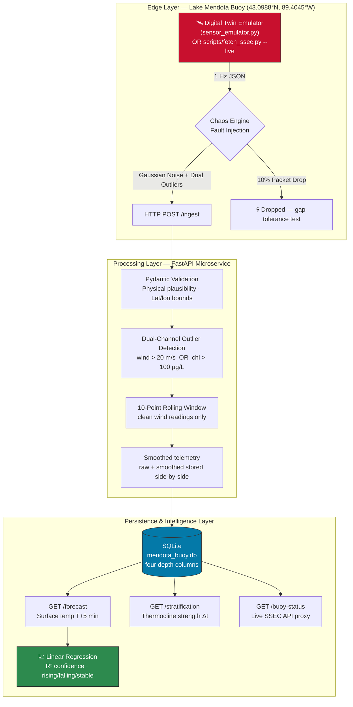

# Sentinel-Stream: Lake Mendota Digital Twin
## Real-Time Environmental Intelligence Pipeline


> **A production-grade, Edge-to-Cloud sensor pipeline** — a digital twin of the UW-Madison SSEC/NTL-LTER Lake Mendota Buoy (43.0988°N, 89.4045°W). Ingests 1 Hz multivariate telemetry, applies outlier-aware noise filtering, and delivers ML-powered 5-minute environmental forecasts. Built to mirror the real-time environmental intelligence architecture at the core of autonomous maritime operations.

---

## The Problem This Solves

Autonomous surface vessels and environmental monitoring systems fail when their data layer fails. Raw sensor telemetry from lake and ocean buoys is:

- **Noisy** — thermistors, anemometers, and fluorometers all exhibit Gaussian measurement error
- **Gappy** — RF packet loss over water is 10–20% under normal conditions
- **Occasionally corrupted** — anemometer saturation, fluorometer lens fouling, GPS drift

A routing algorithm acting on bad data makes bad decisions. Sentinel-Stream is the **data reliability layer** that sits between raw hardware and any intelligent system that consumes environmental data.

---

## Hardware Abstraction Layer

Because the physical [SSEC Mendota Buoy](http://metobs.ssec.wisc.edu/mendota/buoy/) is currently off-station for the winter — confirmed live via `GET /buoy-status`, which proxies the real SSEC API:

```json
{
  "ssec_status_code": 8,
  "ssec_status_message": "Out for the season",
  "ssec_last_updated": "2025-11-19 20:27:38Z",
  "pipeline_mode": "emulator",
  "ssec_api_reachable": true
}
```

...I developed a **high-fidelity Digital Twin emulator** calibrated to historical SSEC datasets. It generates telemetry based on real late-March post ice-out conditions — including vertical temperature profiles and chlorophyll-a — to allow year-round model training and API development. When the buoy returns to service (~May), a single command replaces the emulator with live hardware telemetry:

```bash
python scripts/fetch_ssec.py --live   # no pipeline changes required
```

This is standard practice in autonomous systems engineering: you build and validate the software stack against a high-fidelity digital twin so the hardware integration is a swap, not a rebuild.

---

## System Architecture



**Data flows in one direction:** edge hardware → validation → filtering → persistence → intelligence. Each layer has one job and fails cleanly when its contract is violated.

---

## Features

### Sensor Emulation
- **1 Hz multivariate stream** — atmospheric (air temp, wind) + sub-surface temperature profile (0m, 5m, 10m, 20m) + chlorophyll-a
- **Seasonally calibrated** — late March post ice-out: ~4°C isothermal profile with ±0.3°C diurnal heating (vs ±1.5°C summer); correct for Lake Mendota's current ice-off conditions
- **Dual-channel chaos engineering** — wind outliers (anemometer saturation) AND chlorophyll outliers (fluorometer fouling), independently configurable via env vars

### Data Reliability
- **Outlier-aware rolling average** — 10-point window over clean wind readings only; a single bad packet never corrupts the next 10 smoothed values
- **Full audit trail** — raw and smoothed values, all four depth temperatures, chlorophyll, and `is_outlier` flag stored side-by-side for post-incident forensic analysis
- **Physical validation at the boundary** — Pydantic rejects impossible values (negative wind, lat outside Lake Mendota bounding box, impossible pressures) before they touch the database

### Intelligence API
- **`GET /forecast`** — scikit-learn Linear Regression on last 100 clean records; predicts surface (0m) water temperature 5 minutes ahead with R² confidence score
- **`GET /stratification`** — computes thermocline strength (water_temp_0m − water_temp_20m) and returns `stratified` / `weakly_stratified` / `mixed`; currently reads `mixed` (Δt ≈ 0.6°C, accurate for post ice-out conditions)
- **`GET /buoy-status`** — live proxy to the real SSEC MetObs API; `pipeline_mode` field tells callers whether data is synthetic or live hardware

### Live Data Integration
- **`scripts/fetch_ssec.py`** — connects to the real `metobs.ssec.wisc.edu` API; `--status` / `--historical` / `--live` modes; handles SSEC's pseudo-CSV format and maps `water_temp_N` sensor indices to thermistor chain depths

---

## Tech Stack

| Layer | Technology | Why |
|---|---|---|
| API | FastAPI 0.111 | Async-native, auto-generated OpenAPI docs, native Pydantic v2 |
| Validation | Pydantic v2 | Physical-plausibility constraints per field; nested schema for depth profile |
| Persistence | SQLAlchemy 2.0 + SQLite | Zero-config edge storage; four depth columns enable direct SQL stratification queries |
| ML | scikit-learn LinearRegression | <1 ms inference on edge hardware; interpretable slope = °C/s warming rate |
| Data | pandas + NumPy | Relative-time feature engineering; depth-attenuated diurnal heating model |
| Container | Docker + Compose | Health-gated multi-service startup; `sensor` depends on `api` health check |
| Testing | pytest + httpx + StaticPool | Per-test in-memory DB isolation via dependency override; zero production state pollution |

---

## Sensor Schema

Mirrors the [NTL-LTER Lake Mendota high-frequency buoy data product](https://lter.limnology.wisc.edu/dataset/north-temperate-lakes-lter-high-frequency-data-meteorological-dissolved-oxygen-chlorophyll). Values calibrated to **late March post ice-out** — the water column is nearly isothermal at ~4°C before spring stratification begins:

```json
{
  "timestamp": "2026-03-22T20:27:00Z",
  "location": "Lake Mendota — 1.5 km NE of Picnic Point, Madison, WI",
  "lat": 43.0988,
  "long": -89.4045,
  "air_temp_c": 6.0,
  "wind_speed_ms": 6.0,
  "water_temp_profile": {
    "0m": 4.0,
    "5m": 3.8,
    "10m": 3.6,
    "20m": 3.4
  },
  "chlorophyll_ugl": 6.5
}
```

> **Units clarification:** The SSEC fluorometer reports raw Relative Fluorescence Units (RFU) which can read 5,000–15,000 RFU. These are **not** µg/L. The Turner Cyclops-7F sensor on the Mendota buoy uses a site-specific calibration factor (~0.001–0.003 µg/L/RFU). This pipeline stores calibrated µg/L values throughout.

---

## Quick Start

### Local
```bash
pip install -r requirements.txt

# Terminal 1 — start the API
uvicorn main:app --reload

# Terminal 2 — start the digital twin emulator
python sensor_emulator.py

# Explore the live API docs
open http://localhost:8000/docs
```

### Docker (one command)
```bash
docker-compose up --build
# Sensor emulator starts automatically once the API passes its health check
# API docs: http://localhost:8000/docs
```

---

## API Reference

| Method | Endpoint | Description |
|---|---|---|
| `POST` | `/ingest` | Ingest validated buoy telemetry; returns smoothed wind, outlier flag, surface temp |
| `GET` | `/forecast` | 5-min surface water temp forecast — Linear Regression with R² confidence |
| `GET` | `/stratification` | Thermocline strength (0m − 20m Δt); `stratified` / `weakly_stratified` / `mixed` |
| `GET` | `/buoy-status` | Live proxy to SSEC MetObs API — `pipeline_mode: live` or `emulator` |
| `GET` | `/status` | System health probe — Docker healthcheck target |
| `GET` | `/readings?n=20` | Last N buoy records with full depth profile |
| `GET` | `/docs` | Auto-generated interactive OpenAPI documentation |

---

## Chaos Engineering

| Fault Mode | Rate | What It Simulates | Pipeline Response |
|---|---|---|---|
| Gaussian noise | Every packet | Thermistor / anemometer / fluorometer instrument noise | Rolling average absorbs it |
| Packet drop | 10% | LoRaWAN / Wi-Fi loss between buoy and shore station | Stateless per-request API; gaps cause no state corruption |
| Wind outlier | ~2.5% | Anemometer saturation (spray, mechanical fault) | `is_outlier=True`, excluded from rolling buffer and forecast |
| Chlorophyll outlier | ~2.5% | Fluorometer lens fouling from seasonal biofilm | `is_outlier=True`, excluded from forecast regression |

All rates are tunable via environment variables (`PACKET_DROP_RATE`, `OUTLIER_RATE`) without restarting the emulator.

---

## Design Decisions

**Why Linear Regression for `/forecast`?**
In edge-compute environments — a shore-station SBC or the compute unit on an autonomous surface vessel — inference latency and resource consumption matter. Linear regression fits 100 records in <1 ms, produces an interpretable slope coefficient (°C/s surface warming rate) that operators can sanity-check against known seasonal dynamics, and provides an R² confidence score the calling system can use to decide whether to trust the prediction. A Deep Learning model would be overkill for a 5-minute horizon on a slowly-changing limnological signal.

**Why SQLite over a time-series database?**
Zero configuration, no daemon, single-file portability. This mirrors how environmental data is stored locally on buoy electronics or shore-station edge computers before batch-sync to a central archive (e.g., the UW-Madison SSEC data servers). The API contract is designed so a TimescaleDB or InfluxDB drop-in requires only changing `DATABASE_URL` — the endpoints and schemas are unchanged.

**Why store outliers instead of discarding them?**
Quarantining outliers from the smoothing buffer and forecast regression protects analytics. But discarding them would destroy the forensic record — you can't correlate a false harmful algal bloom alert with a fluorometer fouling event if the event was never persisted. Every packet is stored; only the `is_outlier` flag determines whether it influences downstream analytics.

**Why separate DB columns per depth?**
`water_temp_0m`, `water_temp_5m`, `water_temp_10m`, `water_temp_20m` as individual Float columns allows direct SQL aggregation on stratification metrics (`water_temp_0m - water_temp_20m`) without deserializing JSON blobs. This matters when querying stratification trends across thousands of records for seasonal analysis.

---

## Testing

```bash
pytest tests/ -v   # 17 tests, all passing
```

| Test Class | Coverage |
|---|---|
| `TestIngestEndpoint` | Valid ingest, wind outlier, chlorophyll outlier, rolling average math, outlier buffer exclusion, surface temp echo |
| `TestForecastEndpoint` | 422 on insufficient data, rising-trend structure validation |
| `TestStatusEndpoint` | Health probe, record count increment |
| `TestPydanticValidation` | Missing field, lat out-of-range, negative wind, negative chlorophyll, empty body |
| `TestReadingsEndpoint` | Empty DB, full depth profile structure in response |

Each test gets a **fresh in-memory SQLite database** via `StaticPool` + `app.dependency_overrides` — no shared state, no production file pollution.

---

## Live Data Integration

```bash
# Check real SSEC buoy status (works any time, year-round)
python scripts/fetch_ssec.py --status

# Seed DB with real July 2024 summer data
python scripts/fetch_ssec.py --historical --begin 2024-07-01 --end 2024-07-31

# Live mode — replace emulator with real hardware (buoy online ~May–Nov)
python scripts/fetch_ssec.py --live
```

**Verified SSEC API endpoints:**
```
Status:  GET http://metobs.ssec.wisc.edu/api/status/mendota/buoy.json
Data:    GET http://metobs.ssec.wisc.edu/api/data.csv
             ?site=mendota&inst=buoy
             &symbols=air_temp:wind_speed:water_temp_1:water_temp_5:
                      water_temp_7:water_temp_9:chlorophyll:phycocyanin
             &begin=2024-07-01T00:00:00Z&end=2024-07-31T23:59:59Z&interval=1m
```

---

## Data Reference

| Resource | Link |
|---|---|
| NTL-LTER buoy dataset | [High-Frequency Met, DO, and Chlorophyll Data](https://lter.limnology.wisc.edu/dataset/north-temperate-lakes-lter-high-frequency-data-meteorological-dissolved-oxygen-chlorophyll) |
| Live SSEC data portal | [metobs.ssec.wisc.edu/mendota/buoy](http://metobs.ssec.wisc.edu/mendota/buoy/) |
| Buoy operator | UW-Madison Space Science and Engineering Center (SSEC) + Center for Limnology |
| Buoy position | 43.0988° N, 89.4045° W — 1.5 km NE of Picnic Point, Lake Mendota |

---

*Built by a UW-Madison student as a demonstration of Edge-to-Cloud IoT architecture, real-time environmental intelligence, and autonomous systems data reliability engineering.*
